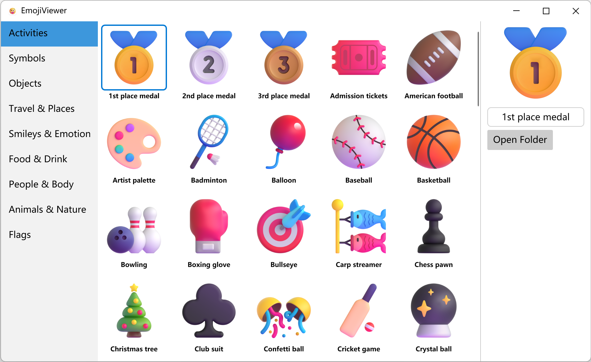

   

  
  <h1>SonomaWallpaper</h1>
  

    Sonoma Wallpaper 是首款将 macOS Sonoma 4k 240 帧动态屏保壁纸带到 Windows 11 的软件，壁纸包含了自然景观、城市景观、水下景观和地球四个主题的屏保共 134 个视频壁纸。
  

  
  
   
   

  
   
  

## 下载
https://github.com/he55/SonomaWallpaper/releases/latest

## 离线壁纸
将下载的壁纸放到 `文档` 文件夹下的 `SonomaWallpaper` 目录，然后彻底退出软件再重新打开

- https://www.alipan.com/s/wHAC9m6fm9n
- https://pan.baidu.com/s/1ZTJUj0IEf_RcFLO0PCx1Ng?pwd=e2on

## 功能
- 4k 240 帧率视频播放
- 多语言
- 高 dpi 支持
- 深色模式
- 多任务下载
- Windows 11 支持

## 要做
- [ ] Windows 12 支持
