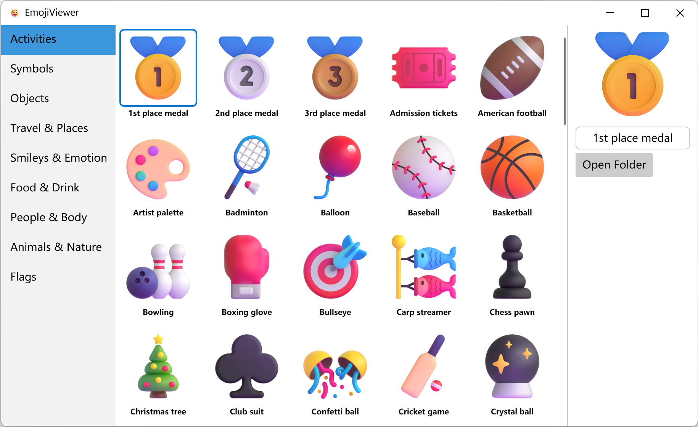

   

  
  <h1>SonomaWallpaper</h1>
  

    Sonoma Wallpaper 是首款将 macOS Sonoma 4k 120 帧动态屏保壁纸带到 Windows 11 的软件，壁纸包含了自然景观、城市景观、水下景观和地球四个主题的屏保共 134 个视频壁纸。
  

  
  
   
   

  
   
  

## 下载
https://github.com/he55/SonomaWallpaper/releases/latest
