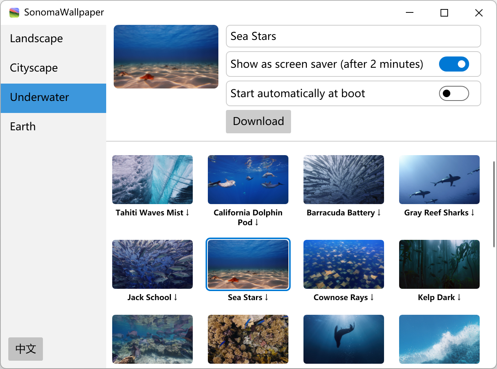

# SonomaWallpaper
Sonoma Wallpaper 是首款将 macOS Sonoma 4k 120 帧动态屏保壁纸带到 Windows 11 的软件，壁纸包含了自然景观、城市景观、水下景观和地球四个主题的屏保。

## 下载
https://github.com/he55/SonomaWallpaper/releases

## 功能
- 4k 120 帧率视频播放
- 多语言
- 高 dpi 支持
- 深色模式
- 多任务下载
- Windows 11 支持

## 要做
- [ ] Windows 12 支持
